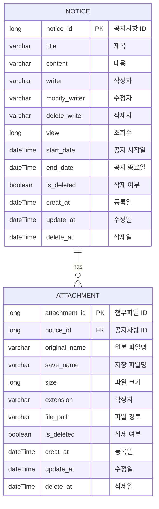

## 알서포트 기업 과제

## 요구사항

**[기능 요구사항]**

* 공지사항 등록, 수정, 삭제, 조회 API를 구현한다.

* 공지사항 등록시 입력 항목은 다음과 같다.
    * 제목, 내용, 공지 시작일시, 공지 종료일시, 첨부파일 (여러개)

* 공지사항 조회시 응답은 다음과 같다.
    * 제목, 내용, 등록일시, 조회수, 작성자

**[비기능 요구사항 및 평가 항목]**

* REST API로 구현.

* 개발 언어는 Java, Kotlin 중 익숙한 개발 언어로 한다.

* 웹 프레임 워크는 Spring Boot 을 사용한다.

* Persistence 프레임 워크는 Hibernate 사용시 가산점

* 데이터 베이스는 제약 없음

* 기능 및 제약사항에 대한 단위/통합테스트 작성

* 대용량 트래픽을 고려하여 구현할 것

* 핵심 문제해결 전략 및 실행 방법 등을 README 파일에 명시

## 기술 스택
### 애플리케이션
* **Framework**: Spring Boot 3.4.2
* **Architecture**: Layered Architecture
### 데이터
* **Database**: H2
* **DB ORM**: JPA (Hibernate)
* **Cache**: Caffeine 
### API 문서화
* **API Docs**: Spring Docs
### 테스트 및 품질
* **Test Framework**: JUnit, AssertJ

## git branch 관리

- 개발 : main 브랜치에서 새 브랜치 생성하여 작업

  >  예시: [feat] pointCharge

- PR : 새 브랜치에서 작업 종료되면 main 브랜치로 remote push, 새브랜치 -> main 브랜치 PR

- 업무 종류 :

  > - [feat] : 새로운 기능 추가, 기존의 기능을 요구 사항에 맞추어 수정
  > - [fix] : 기능에 대한 버그 수정
  > - [refactor] : 기능의 변화가 아닌 코드 리팩터링 ex) 변수 이름 변경
  > - [test] : 테스트 코드 추가/수정
  > - [build] : 빌드 관련 수정
  > - [chore] : 패키지 매니저 수정, 그 외 기타 수정 ex) .gitignore
  > - [docs] : 문서(주석) 수정
  > - [style] : 코드 스타일, 포맷팅에 대한 수정
  > - [delete] : 파일 삭제

### ERD

